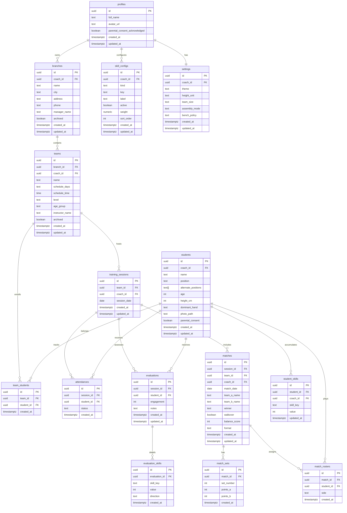

# Data Architecture: Esporte Recreacao

## Diagrama de Entidades (Mermaid)



---

## Funcoes Auxiliares

### fn_update_timestamp

Funcao generica reutilizada por todas as tabelas para atualizar `updated_at`.

```sql
CREATE OR REPLACE FUNCTION fn_update_timestamp()
RETURNS TRIGGER AS $$
BEGIN
  NEW.updated_at = now();
  RETURN NEW;
END;
$$ LANGUAGE plpgsql;
```

### fn_is_coach_owner_of_team

Helper SECURITY DEFINER para verificar ownership de turma via cadeia branch > coach.
Usada em policies de tabelas-filhas (attendances, evaluations, matches, etc.).

```sql
CREATE OR REPLACE FUNCTION fn_is_coach_owner_of_team(p_team_id UUID)
RETURNS BOOLEAN
LANGUAGE plpgsql
SECURITY DEFINER
SET search_path = public
AS $$
BEGIN
  RETURN EXISTS (
    SELECT 1
    FROM teams t
    JOIN branches b ON b.id = t.branch_id
    WHERE t.id = p_team_id
      AND b.coach_id = (SELECT auth.uid())
  );
END;
$$;
```

**Motivo do SECURITY DEFINER:** Permite que a verificacao de ownership percorra a cadeia teams > branches sem depender de policies intermediarias que poderiam bloquear o acesso recursivamente. `SET search_path = public` previne search_path injection.

### fn_is_coach_owner_of_session

Helper para verificar ownership de sessao de treino via cadeia session > team > branch > coach.

```sql
CREATE OR REPLACE FUNCTION fn_is_coach_owner_of_session(p_session_id UUID)
RETURNS BOOLEAN
LANGUAGE plpgsql
SECURITY DEFINER
SET search_path = public
AS $$
BEGIN
  RETURN EXISTS (
    SELECT 1
    FROM training_sessions ts
    JOIN teams t ON t.id = ts.team_id
    JOIN branches b ON b.id = t.branch_id
    WHERE ts.id = p_session_id
      AND b.coach_id = (SELECT auth.uid())
  );
END;
$$;
```

**Motivo do SECURITY DEFINER:** Mesma justificativa -- acesso a cadeia sem depender de policies intermediarias.

### fn_is_coach_owner_of_match

Helper para verificar ownership de partida via cadeia match > team > branch > coach.

```sql
CREATE OR REPLACE FUNCTION fn_is_coach_owner_of_match(p_match_id UUID)
RETURNS BOOLEAN
LANGUAGE plpgsql
SECURITY DEFINER
SET search_path = public
AS $$
BEGIN
  RETURN EXISTS (
    SELECT 1
    FROM matches m
    JOIN teams t ON t.id = m.team_id
    JOIN branches b ON b.id = t.branch_id
    WHERE m.id = p_match_id
      AND b.coach_id = (SELECT auth.uid())
  );
END;
$$;
```

### fn_is_coach_owner_of_evaluation

Helper para verificar ownership de avaliacao via cadeia evaluation > session > team > branch > coach.

```sql
CREATE OR REPLACE FUNCTION fn_is_coach_owner_of_evaluation(p_evaluation_id UUID)
RETURNS BOOLEAN
LANGUAGE plpgsql
SECURITY DEFINER
SET search_path = public
AS $$
BEGIN
  RETURN EXISTS (
    SELECT 1
    FROM evaluations e
    JOIN training_sessions ts ON ts.id = e.session_id
    JOIN teams t ON t.id = ts.team_id
    JOIN branches b ON b.id = t.branch_id
    WHERE e.id = p_evaluation_id
      AND b.coach_id = (SELECT auth.uid())
  );
END;
$$;
```

### fn_prevent_branch_delete_with_active_teams

Trigger que impede exclusao de filial com turmas ativas (archived = false).

```sql
CREATE OR REPLACE FUNCTION fn_prevent_branch_delete_with_active_teams()
RETURNS TRIGGER
LANGUAGE plpgsql
SET search_path = public
AS $$
BEGIN
  IF EXISTS (
    SELECT 1 FROM teams
    WHERE branch_id = OLD.id
      AND archived = false
  ) THEN
    RAISE EXCEPTION 'Cannot delete branch with active teams. Archive or delete all teams first.';
  END IF;
  RETURN OLD;
END;
$$;
```

### fn_initialize_coach_settings

Trigger AFTER INSERT em profiles que cria o registro de settings padrao para o novo coach.

```sql
CREATE OR REPLACE FUNCTION fn_initialize_coach_settings()
RETURNS TRIGGER
LANGUAGE plpgsql
SECURITY DEFINER
SET search_path = public
AS $$
BEGIN
  INSERT INTO settings (coach_id)
  VALUES (NEW.id);
  RETURN NEW;
END;
$$;
```

**Motivo do SECURITY DEFINER:** O INSERT em settings precisa acontecer durante o signup, quando RLS ainda restringiria a operacao.

### fn_initialize_default_skill_configs

Trigger AFTER INSERT em profiles que cria os fundamentos padrao para o novo coach.

```sql
CREATE OR REPLACE FUNCTION fn_initialize_default_skill_configs()
RETURNS TRIGGER
LANGUAGE plpgsql
SECURITY DEFINER
SET search_path = public
AS $$
BEGIN
  INSERT INTO skill_configs (coach_id, kind, key, label, active, weight, sort_order) VALUES
    (NEW.id, 'technical', 'saque',         'Saque',              true,  1.0, 1),
    (NEW.id, 'technical', 'recepcao',      'Recepcao',           true,  1.2, 2),
    (NEW.id, 'technical', 'levantamento',  'Levantamento',       true,  1.3, 3),
    (NEW.id, 'technical', 'ataque',        'Ataque',             true,  1.4, 4),
    (NEW.id, 'technical', 'bloqueio',      'Bloqueio',           true,  1.0, 5),
    (NEW.id, 'technical', 'defesa',        'Defesa',             true,  1.0, 6),
    (NEW.id, 'technical', 'posicionamento','Posicionamento',     false, 1.0, 7),
    (NEW.id, 'soft',      'comportamento', 'Comportamento',      true,  1.0, 1),
    (NEW.id, 'soft',      'proatividade',  'Proatividade',       true,  1.0, 2),
    (NEW.id, 'soft',      'apoio',         'Apoio ao time',      true,  1.0, 3),
    (NEW.id, 'soft',      'comunicacao',   'Comunicacao',        false, 1.0, 4),
    (NEW.id, 'soft',      'esforco',       'Esforco',            true,  1.0, 5);
  RETURN NEW;
END;
$$;
```

**Motivo do SECURITY DEFINER:** Mesma justificativa do settings -- INSERT durante signup precisa bypass de RLS.

---

## Tabelas

### profiles

Perfil do coach. Estende `auth.users` via 1:1 (mesmo UUID). Criado automaticamente via trigger no signup.

```sql
CREATE TABLE profiles (
  id         UUID PRIMARY KEY REFERENCES auth.users(id) ON DELETE CASCADE,
  full_name  TEXT NOT NULL DEFAULT '',
  avatar_url TEXT,
  parental_consent_acknowledged BOOLEAN NOT NULL DEFAULT false,
  created_at TIMESTAMPTZ DEFAULT now() NOT NULL,
  updated_at TIMESTAMPTZ DEFAULT now() NOT NULL
);

ALTER TABLE profiles ENABLE ROW LEVEL SECURITY;

-- Policies
CREATE POLICY profiles_select_own ON profiles
  FOR SELECT USING (id = (SELECT auth.uid()));

CREATE POLICY profiles_insert_own ON profiles
  FOR INSERT WITH CHECK (id = (SELECT auth.uid()));

CREATE POLICY profiles_update_own ON profiles
  FOR UPDATE USING (id = (SELECT auth.uid()))
  WITH CHECK (id = (SELECT auth.uid()));

-- Trigger: updated_at
CREATE TRIGGER trg_profiles_updated_at
  BEFORE UPDATE ON profiles
  FOR EACH ROW EXECUTE FUNCTION fn_update_timestamp();

-- Trigger: criar settings padrao ao registrar
CREATE TRIGGER trg_profiles_after_insert_settings
  AFTER INSERT ON profiles
  FOR EACH ROW EXECUTE FUNCTION fn_initialize_coach_settings();

-- Trigger: criar skill_configs padrao ao registrar
CREATE TRIGGER trg_profiles_after_insert_skills
  AFTER INSERT ON profiles
  FOR EACH ROW EXECUTE FUNCTION fn_initialize_default_skill_configs();
```

**Nota:** O trigger de criacao de `profiles` a partir de `auth.users` deve ser configurado via Supabase Auth Hook ou trigger na tabela `auth.users`:

```sql
CREATE OR REPLACE FUNCTION fn_handle_new_user()
RETURNS TRIGGER
LANGUAGE plpgsql
SECURITY DEFINER
SET search_path = public
AS $$
BEGIN
  INSERT INTO profiles (id, full_name)
  VALUES (
    NEW.id,
    COALESCE(NEW.raw_user_meta_data ->> 'full_name', '')
  );
  RETURN NEW;
END;
$$;

CREATE TRIGGER trg_auth_users_after_insert
  AFTER INSERT ON auth.users
  FOR EACH ROW EXECUTE FUNCTION fn_handle_new_user();
```

---

### branches

Filiais/unidades do coach. Cada coach pode ter N filiais.

```sql
CREATE TABLE branches (
  id           UUID PRIMARY KEY DEFAULT gen_random_uuid(),
  coach_id     UUID NOT NULL DEFAULT (SELECT auth.uid()) REFERENCES profiles(id) ON DELETE CASCADE,
  name         TEXT NOT NULL,
  city         TEXT NOT NULL DEFAULT '',
  address      TEXT NOT NULL DEFAULT '',
  phone        TEXT NOT NULL DEFAULT '',
  manager_name TEXT NOT NULL DEFAULT '',
  archived     BOOLEAN NOT NULL DEFAULT false,
  created_at   TIMESTAMPTZ DEFAULT now() NOT NULL,
  updated_at   TIMESTAMPTZ DEFAULT now() NOT NULL
);

ALTER TABLE branches ENABLE ROW LEVEL SECURITY;

-- Policies
CREATE POLICY branches_select_own ON branches
  FOR SELECT USING (coach_id = (SELECT auth.uid()));

CREATE POLICY branches_insert_own ON branches
  FOR INSERT WITH CHECK (coach_id = (SELECT auth.uid()));

CREATE POLICY branches_update_own ON branches
  FOR UPDATE USING (coach_id = (SELECT auth.uid()))
  WITH CHECK (coach_id = (SELECT auth.uid()));

CREATE POLICY branches_delete_own ON branches
  FOR DELETE USING (coach_id = (SELECT auth.uid()));

-- Trigger: updated_at
CREATE TRIGGER trg_branches_updated_at
  BEFORE UPDATE ON branches
  FOR EACH ROW EXECUTE FUNCTION fn_update_timestamp();

-- Trigger: impedir delete de filial com turmas ativas
CREATE TRIGGER trg_branches_before_delete_check_teams
  BEFORE DELETE ON branches
  FOR EACH ROW EXECUTE FUNCTION fn_prevent_branch_delete_with_active_teams();

-- Indices
CREATE INDEX idx_branches_coach_id ON branches(coach_id);
```

---

### teams

Turmas vinculadas a uma filial. Cada turma pertence a uma filial e, por cadeia, a um coach.

`coach_id` e denormalizado propositalmente para simplificar RLS policies -- evita JOINs em policies SELECT de turmas e tabelas-filhas. Consistencia garantida: INSERT valida que a filial pertence ao coach via WITH CHECK.

```sql
CREATE TABLE teams (
  id              UUID PRIMARY KEY DEFAULT gen_random_uuid(),
  branch_id       UUID NOT NULL REFERENCES branches(id) ON DELETE CASCADE,
  coach_id        UUID NOT NULL DEFAULT (SELECT auth.uid()) REFERENCES profiles(id) ON DELETE CASCADE,
  name            TEXT NOT NULL,
  schedule_days   TEXT NOT NULL DEFAULT '',
  schedule_time   TIME,
  level           TEXT NOT NULL DEFAULT 'Iniciante'
                    CHECK (level IN ('Iniciante', 'Intermediario', 'Avancado')),
  age_group       TEXT NOT NULL DEFAULT '',
  instructor_name TEXT NOT NULL DEFAULT '',
  archived        BOOLEAN NOT NULL DEFAULT false,
  created_at      TIMESTAMPTZ DEFAULT now() NOT NULL,
  updated_at      TIMESTAMPTZ DEFAULT now() NOT NULL
);

ALTER TABLE teams ENABLE ROW LEVEL SECURITY;

-- Policies
CREATE POLICY teams_select_own ON teams
  FOR SELECT USING (coach_id = (SELECT auth.uid()));

CREATE POLICY teams_insert_own ON teams
  FOR INSERT WITH CHECK (
    coach_id = (SELECT auth.uid())
    AND EXISTS (
      SELECT 1 FROM branches
      WHERE id = branch_id
        AND coach_id = (SELECT auth.uid())
    )
  );

CREATE POLICY teams_update_own ON teams
  FOR UPDATE USING (coach_id = (SELECT auth.uid()))
  WITH CHECK (coach_id = (SELECT auth.uid()));

CREATE POLICY teams_delete_own ON teams
  FOR DELETE USING (coach_id = (SELECT auth.uid()));

-- Trigger: updated_at
CREATE TRIGGER trg_teams_updated_at
  BEFORE UPDATE ON teams
  FOR EACH ROW EXECUTE FUNCTION fn_update_timestamp();

-- Indices
CREATE INDEX idx_teams_coach_id ON teams(coach_id);
CREATE INDEX idx_teams_branch_id ON teams(branch_id);
```

---

### students

Alunos cadastrados pelo coach. Cada aluno pertence diretamente ao coach (1:N) e pode estar em multiplas turmas via `team_students`.

`coach_id` direto no aluno simplifica RLS e evita cadeia complexa para determinar ownership.

```sql
CREATE TABLE students (
  id                  UUID PRIMARY KEY DEFAULT gen_random_uuid(),
  coach_id            UUID NOT NULL DEFAULT (SELECT auth.uid()) REFERENCES profiles(id) ON DELETE CASCADE,
  name                TEXT NOT NULL,
  position            TEXT NOT NULL DEFAULT ''
                        CHECK (position IN ('', 'LEV', 'PON', 'OPO', 'CEN', 'LIB')),
  alternate_positions TEXT[] NOT NULL DEFAULT '{}',
  age                 INT CHECK (age >= 1 AND age <= 99),
  height_cm           INT CHECK (height_cm >= 50 AND height_cm <= 250),
  dominant_hand       TEXT NOT NULL DEFAULT ''
                        CHECK (dominant_hand IN ('', 'Destro', 'Canhoto', 'Ambidestro')),
  photo_path          TEXT,
  parental_consent    BOOLEAN NOT NULL DEFAULT false,
  created_at          TIMESTAMPTZ DEFAULT now() NOT NULL,
  updated_at          TIMESTAMPTZ DEFAULT now() NOT NULL
);

ALTER TABLE students ENABLE ROW LEVEL SECURITY;

-- Policies
CREATE POLICY students_select_own ON students
  FOR SELECT USING (coach_id = (SELECT auth.uid()));

CREATE POLICY students_insert_own ON students
  FOR INSERT WITH CHECK (coach_id = (SELECT auth.uid()));

CREATE POLICY students_update_own ON students
  FOR UPDATE USING (coach_id = (SELECT auth.uid()))
  WITH CHECK (coach_id = (SELECT auth.uid()));

CREATE POLICY students_delete_own ON students
  FOR DELETE USING (coach_id = (SELECT auth.uid()));

-- Trigger: updated_at
CREATE TRIGGER trg_students_updated_at
  BEFORE UPDATE ON students
  FOR EACH ROW EXECUTE FUNCTION fn_update_timestamp();

-- Indices
CREATE INDEX idx_students_coach_id ON students(coach_id);
```

---

### team_students

Tabela pivote M:N entre turmas e alunos. Um aluno pode estar em multiplas turmas.

```sql
CREATE TABLE team_students (
  id         UUID PRIMARY KEY DEFAULT gen_random_uuid(),
  team_id    UUID NOT NULL REFERENCES teams(id) ON DELETE CASCADE,
  student_id UUID NOT NULL REFERENCES students(id) ON DELETE CASCADE,
  created_at TIMESTAMPTZ DEFAULT now() NOT NULL,

  UNIQUE (team_id, student_id)
);

ALTER TABLE team_students ENABLE ROW LEVEL SECURITY;

-- Policies: validam ownership via EXISTS nos pais
CREATE POLICY team_students_select_own ON team_students
  FOR SELECT USING (
    EXISTS (
      SELECT 1 FROM teams t
      WHERE t.id = team_id AND t.coach_id = (SELECT auth.uid())
    )
  );

CREATE POLICY team_students_insert_own ON team_students
  FOR INSERT WITH CHECK (
    EXISTS (
      SELECT 1 FROM teams t
      WHERE t.id = team_id AND t.coach_id = (SELECT auth.uid())
    )
    AND EXISTS (
      SELECT 1 FROM students s
      WHERE s.id = student_id AND s.coach_id = (SELECT auth.uid())
    )
  );

CREATE POLICY team_students_delete_own ON team_students
  FOR DELETE USING (
    EXISTS (
      SELECT 1 FROM teams t
      WHERE t.id = team_id AND t.coach_id = (SELECT auth.uid())
    )
  );

-- Indices
CREATE INDEX idx_team_students_team_id ON team_students(team_id);
CREATE INDEX idx_team_students_student_id ON team_students(student_id);
```

---

### skill_configs

Configuracao de fundamentos por coach. Cada coach pode ativar/desativar fundamentos e definir pesos. Fundamentos padrao criados automaticamente via trigger ao registrar.

```sql
CREATE TABLE skill_configs (
  id         UUID PRIMARY KEY DEFAULT gen_random_uuid(),
  coach_id   UUID NOT NULL DEFAULT (SELECT auth.uid()) REFERENCES profiles(id) ON DELETE CASCADE,
  kind       TEXT NOT NULL CHECK (kind IN ('technical', 'soft')),
  key        TEXT NOT NULL,
  label      TEXT NOT NULL,
  active     BOOLEAN NOT NULL DEFAULT true,
  weight     NUMERIC(3, 1) NOT NULL DEFAULT 1.0,
  sort_order INT NOT NULL DEFAULT 0,
  created_at TIMESTAMPTZ DEFAULT now() NOT NULL,
  updated_at TIMESTAMPTZ DEFAULT now() NOT NULL,

  UNIQUE (coach_id, key)
);

ALTER TABLE skill_configs ENABLE ROW LEVEL SECURITY;

-- Policies
CREATE POLICY skill_configs_select_own ON skill_configs
  FOR SELECT USING (coach_id = (SELECT auth.uid()));

CREATE POLICY skill_configs_insert_own ON skill_configs
  FOR INSERT WITH CHECK (coach_id = (SELECT auth.uid()));

CREATE POLICY skill_configs_update_own ON skill_configs
  FOR UPDATE USING (coach_id = (SELECT auth.uid()))
  WITH CHECK (coach_id = (SELECT auth.uid()));

-- Trigger: updated_at
CREATE TRIGGER trg_skill_configs_updated_at
  BEFORE UPDATE ON skill_configs
  FOR EACH ROW EXECUTE FUNCTION fn_update_timestamp();

-- Indices
CREATE INDEX idx_skill_configs_coach_id ON skill_configs(coach_id);
```

---

### training_sessions

Sessoes de treino. Cada sessao pertence a uma turma e registra a data do treino.

```sql
CREATE TABLE training_sessions (
  id           UUID PRIMARY KEY DEFAULT gen_random_uuid(),
  team_id      UUID NOT NULL REFERENCES teams(id) ON DELETE CASCADE,
  coach_id     UUID NOT NULL DEFAULT (SELECT auth.uid()) REFERENCES profiles(id) ON DELETE CASCADE,
  session_date DATE NOT NULL DEFAULT CURRENT_DATE,
  created_at   TIMESTAMPTZ DEFAULT now() NOT NULL,
  updated_at   TIMESTAMPTZ DEFAULT now() NOT NULL
);

ALTER TABLE training_sessions ENABLE ROW LEVEL SECURITY;

-- Policies
CREATE POLICY sessions_select_own ON training_sessions
  FOR SELECT USING (coach_id = (SELECT auth.uid()));

CREATE POLICY sessions_insert_own ON training_sessions
  FOR INSERT WITH CHECK (
    coach_id = (SELECT auth.uid())
    AND fn_is_coach_owner_of_team(team_id)
  );

CREATE POLICY sessions_update_own ON training_sessions
  FOR UPDATE USING (coach_id = (SELECT auth.uid()))
  WITH CHECK (coach_id = (SELECT auth.uid()));

CREATE POLICY sessions_delete_own ON training_sessions
  FOR DELETE USING (coach_id = (SELECT auth.uid()));

-- Trigger: updated_at
CREATE TRIGGER trg_training_sessions_updated_at
  BEFORE UPDATE ON training_sessions
  FOR EACH ROW EXECUTE FUNCTION fn_update_timestamp();

-- Indices
CREATE INDEX idx_training_sessions_coach_id ON training_sessions(coach_id);
CREATE INDEX idx_training_sessions_team_id ON training_sessions(team_id);
CREATE INDEX idx_training_sessions_date ON training_sessions(session_date);
```

---

### attendances

Presenca por treino. Cada registro vincula um aluno a uma sessao com status.

```sql
CREATE TABLE attendances (
  id         UUID PRIMARY KEY DEFAULT gen_random_uuid(),
  session_id UUID NOT NULL REFERENCES training_sessions(id) ON DELETE CASCADE,
  student_id UUID NOT NULL REFERENCES students(id) ON DELETE CASCADE,
  status     TEXT NOT NULL DEFAULT 'present'
               CHECK (status IN ('present', 'absent', 'late')),
  created_at TIMESTAMPTZ DEFAULT now() NOT NULL,

  UNIQUE (session_id, student_id)
);

ALTER TABLE attendances ENABLE ROW LEVEL SECURITY;

-- Policies: ownership validado via sessao pai
CREATE POLICY attendances_select_own ON attendances
  FOR SELECT USING (fn_is_coach_owner_of_session(session_id));

CREATE POLICY attendances_insert_own ON attendances
  FOR INSERT WITH CHECK (fn_is_coach_owner_of_session(session_id));

CREATE POLICY attendances_update_own ON attendances
  FOR UPDATE USING (fn_is_coach_owner_of_session(session_id))
  WITH CHECK (fn_is_coach_owner_of_session(session_id));

CREATE POLICY attendances_delete_own ON attendances
  FOR DELETE USING (fn_is_coach_owner_of_session(session_id));

-- Indices
CREATE INDEX idx_attendances_session_id ON attendances(session_id);
CREATE INDEX idx_attendances_student_id ON attendances(student_id);
```

---

### evaluations

Avaliacao por treino + aluno. Registra engajamento (1-5) e observacoes.

```sql
CREATE TABLE evaluations (
  id         UUID PRIMARY KEY DEFAULT gen_random_uuid(),
  session_id UUID NOT NULL REFERENCES training_sessions(id) ON DELETE CASCADE,
  student_id UUID NOT NULL REFERENCES students(id) ON DELETE CASCADE,
  engagement INT NOT NULL DEFAULT 3 CHECK (engagement >= 1 AND engagement <= 5),
  notes      TEXT NOT NULL DEFAULT '',
  created_at TIMESTAMPTZ DEFAULT now() NOT NULL,
  updated_at TIMESTAMPTZ DEFAULT now() NOT NULL,

  UNIQUE (session_id, student_id)
);

ALTER TABLE evaluations ENABLE ROW LEVEL SECURITY;

-- Policies
CREATE POLICY evaluations_select_own ON evaluations
  FOR SELECT USING (fn_is_coach_owner_of_session(session_id));

CREATE POLICY evaluations_insert_own ON evaluations
  FOR INSERT WITH CHECK (fn_is_coach_owner_of_session(session_id));

CREATE POLICY evaluations_update_own ON evaluations
  FOR UPDATE USING (fn_is_coach_owner_of_session(session_id))
  WITH CHECK (fn_is_coach_owner_of_session(session_id));

CREATE POLICY evaluations_delete_own ON evaluations
  FOR DELETE USING (fn_is_coach_owner_of_session(session_id));

-- Trigger: updated_at
CREATE TRIGGER trg_evaluations_updated_at
  BEFORE UPDATE ON evaluations
  FOR EACH ROW EXECUTE FUNCTION fn_update_timestamp();

-- Indices
CREATE INDEX idx_evaluations_session_id ON evaluations(session_id);
CREATE INDEX idx_evaluations_student_id ON evaluations(student_id);
```

---

### evaluation_skills

Detalhamento de fundamentos por avaliacao. Cada registro e um ajuste de fundamento (up/down/stable) com valor 1-5.

```sql
CREATE TABLE evaluation_skills (
  id            UUID PRIMARY KEY DEFAULT gen_random_uuid(),
  evaluation_id UUID NOT NULL REFERENCES evaluations(id) ON DELETE CASCADE,
  skill_key     TEXT NOT NULL,
  value         INT NOT NULL CHECK (value >= 1 AND value <= 5),
  direction     TEXT NOT NULL DEFAULT 'stable'
                  CHECK (direction IN ('up', 'down', 'stable')),
  created_at    TIMESTAMPTZ DEFAULT now() NOT NULL
);

ALTER TABLE evaluation_skills ENABLE ROW LEVEL SECURITY;

-- Policies: ownership validado via avaliacao pai
CREATE POLICY eval_skills_select_own ON evaluation_skills
  FOR SELECT USING (fn_is_coach_owner_of_evaluation(evaluation_id));

CREATE POLICY eval_skills_insert_own ON evaluation_skills
  FOR INSERT WITH CHECK (fn_is_coach_owner_of_evaluation(evaluation_id));

CREATE POLICY eval_skills_update_own ON evaluation_skills
  FOR UPDATE USING (fn_is_coach_owner_of_evaluation(evaluation_id))
  WITH CHECK (fn_is_coach_owner_of_evaluation(evaluation_id));

CREATE POLICY eval_skills_delete_own ON evaluation_skills
  FOR DELETE USING (fn_is_coach_owner_of_evaluation(evaluation_id));

-- Indices
CREATE INDEX idx_evaluation_skills_evaluation_id ON evaluation_skills(evaluation_id);
```

---

### matches

Partidas realizadas durante treinos. Registra times, vencedor, equilibrio e formato.

```sql
CREATE TABLE matches (
  id            UUID PRIMARY KEY DEFAULT gen_random_uuid(),
  session_id    UUID REFERENCES training_sessions(id) ON DELETE SET NULL,
  team_id       UUID NOT NULL REFERENCES teams(id) ON DELETE CASCADE,
  coach_id      UUID NOT NULL DEFAULT (SELECT auth.uid()) REFERENCES profiles(id) ON DELETE CASCADE,
  match_date    DATE NOT NULL DEFAULT CURRENT_DATE,
  team_a_name   TEXT NOT NULL DEFAULT 'Time A',
  team_b_name   TEXT NOT NULL DEFAULT 'Time B',
  winner        TEXT CHECK (winner IN ('a', 'b')),
  walkover      BOOLEAN NOT NULL DEFAULT false,
  balance_score INT CHECK (balance_score >= 0 AND balance_score <= 100),
  format        TEXT NOT NULL DEFAULT '6x6',
  created_at    TIMESTAMPTZ DEFAULT now() NOT NULL,
  updated_at    TIMESTAMPTZ DEFAULT now() NOT NULL
);

ALTER TABLE matches ENABLE ROW LEVEL SECURITY;

-- Policies
CREATE POLICY matches_select_own ON matches
  FOR SELECT USING (coach_id = (SELECT auth.uid()));

CREATE POLICY matches_insert_own ON matches
  FOR INSERT WITH CHECK (
    coach_id = (SELECT auth.uid())
    AND fn_is_coach_owner_of_team(team_id)
  );

CREATE POLICY matches_update_own ON matches
  FOR UPDATE USING (coach_id = (SELECT auth.uid()))
  WITH CHECK (coach_id = (SELECT auth.uid()));

CREATE POLICY matches_delete_own ON matches
  FOR DELETE USING (coach_id = (SELECT auth.uid()));

-- Trigger: updated_at
CREATE TRIGGER trg_matches_updated_at
  BEFORE UPDATE ON matches
  FOR EACH ROW EXECUTE FUNCTION fn_update_timestamp();

-- Indices
CREATE INDEX idx_matches_coach_id ON matches(coach_id);
CREATE INDEX idx_matches_team_id ON matches(team_id);
CREATE INDEX idx_matches_session_id ON matches(session_id);
CREATE INDEX idx_matches_date ON matches(match_date);
```

---

### match_sets

Sets de uma partida. Cada partida pode ter 1 a N sets (tipicamente 2-5).

```sql
CREATE TABLE match_sets (
  id         UUID PRIMARY KEY DEFAULT gen_random_uuid(),
  match_id   UUID NOT NULL REFERENCES matches(id) ON DELETE CASCADE,
  set_number INT NOT NULL CHECK (set_number >= 1),
  points_a   INT NOT NULL DEFAULT 0 CHECK (points_a >= 0),
  points_b   INT NOT NULL DEFAULT 0 CHECK (points_b >= 0),
  created_at TIMESTAMPTZ DEFAULT now() NOT NULL,

  UNIQUE (match_id, set_number)
);

ALTER TABLE match_sets ENABLE ROW LEVEL SECURITY;

-- Policies: ownership via match pai
CREATE POLICY match_sets_select_own ON match_sets
  FOR SELECT USING (fn_is_coach_owner_of_match(match_id));

CREATE POLICY match_sets_insert_own ON match_sets
  FOR INSERT WITH CHECK (fn_is_coach_owner_of_match(match_id));

CREATE POLICY match_sets_update_own ON match_sets
  FOR UPDATE USING (fn_is_coach_owner_of_match(match_id))
  WITH CHECK (fn_is_coach_owner_of_match(match_id));

CREATE POLICY match_sets_delete_own ON match_sets
  FOR DELETE USING (fn_is_coach_owner_of_match(match_id));

-- Indices
CREATE INDEX idx_match_sets_match_id ON match_sets(match_id);
```

---

### match_rosters

Elenco de cada partida -- quais alunos jogaram em cada time (a ou b).

```sql
CREATE TABLE match_rosters (
  id         UUID PRIMARY KEY DEFAULT gen_random_uuid(),
  match_id   UUID NOT NULL REFERENCES matches(id) ON DELETE CASCADE,
  student_id UUID NOT NULL REFERENCES students(id) ON DELETE CASCADE,
  side       TEXT NOT NULL CHECK (side IN ('a', 'b')),
  created_at TIMESTAMPTZ DEFAULT now() NOT NULL,

  UNIQUE (match_id, student_id)
);

ALTER TABLE match_rosters ENABLE ROW LEVEL SECURITY;

-- Policies: ownership via match pai
CREATE POLICY match_rosters_select_own ON match_rosters
  FOR SELECT USING (fn_is_coach_owner_of_match(match_id));

CREATE POLICY match_rosters_insert_own ON match_rosters
  FOR INSERT WITH CHECK (fn_is_coach_owner_of_match(match_id));

CREATE POLICY match_rosters_delete_own ON match_rosters
  FOR DELETE USING (fn_is_coach_owner_of_match(match_id));

-- Indices
CREATE INDEX idx_match_rosters_match_id ON match_rosters(match_id);
CREATE INDEX idx_match_rosters_student_id ON match_rosters(student_id);
```

---

### student_skills

Snapshot atual dos fundamentos de cada aluno. Atualizado a cada avaliacao. Separado de `evaluations` porque persiste entre treinos (o valor "acumulado" do aluno).

```sql
CREATE TABLE student_skills (
  id         UUID PRIMARY KEY DEFAULT gen_random_uuid(),
  student_id UUID NOT NULL REFERENCES students(id) ON DELETE CASCADE,
  coach_id   UUID NOT NULL DEFAULT (SELECT auth.uid()) REFERENCES profiles(id) ON DELETE CASCADE,
  skill_key  TEXT NOT NULL,
  value      INT NOT NULL DEFAULT 3 CHECK (value >= 1 AND value <= 5),
  updated_at TIMESTAMPTZ DEFAULT now() NOT NULL,

  UNIQUE (student_id, skill_key)
);

ALTER TABLE student_skills ENABLE ROW LEVEL SECURITY;

-- Policies
CREATE POLICY student_skills_select_own ON student_skills
  FOR SELECT USING (coach_id = (SELECT auth.uid()));

CREATE POLICY student_skills_insert_own ON student_skills
  FOR INSERT WITH CHECK (coach_id = (SELECT auth.uid()));

CREATE POLICY student_skills_update_own ON student_skills
  FOR UPDATE USING (coach_id = (SELECT auth.uid()))
  WITH CHECK (coach_id = (SELECT auth.uid()));

-- Indices
CREATE INDEX idx_student_skills_student_id ON student_skills(student_id);
CREATE INDEX idx_student_skills_coach_id ON student_skills(coach_id);
```

---

### settings

Configuracoes globais por coach (tema, unidade de medida, preferencias de montagem de time).

```sql
CREATE TABLE settings (
  id            UUID PRIMARY KEY DEFAULT gen_random_uuid(),
  coach_id      UUID NOT NULL UNIQUE REFERENCES profiles(id) ON DELETE CASCADE,
  theme         TEXT NOT NULL DEFAULT 'light'
                  CHECK (theme IN ('light', 'dark', 'system')),
  height_unit   TEXT NOT NULL DEFAULT 'cm'
                  CHECK (height_unit IN ('cm', 'ft')),
  team_size     TEXT NOT NULL DEFAULT '6x6'
                  CHECK (team_size IN ('2x2', '3x3', '4x4', '5x5', '6x6')),
  assembly_mode TEXT NOT NULL DEFAULT 'competitive'
                  CHECK (assembly_mode IN ('competitive', 'development')),
  bench_policy  TEXT NOT NULL DEFAULT 'bench'
                  CHECK (bench_policy IN ('bench', 'rotation')),
  created_at    TIMESTAMPTZ DEFAULT now() NOT NULL,
  updated_at    TIMESTAMPTZ DEFAULT now() NOT NULL
);

ALTER TABLE settings ENABLE ROW LEVEL SECURITY;

-- Policies
CREATE POLICY settings_select_own ON settings
  FOR SELECT USING (coach_id = (SELECT auth.uid()));

CREATE POLICY settings_update_own ON settings
  FOR UPDATE USING (coach_id = (SELECT auth.uid()))
  WITH CHECK (coach_id = (SELECT auth.uid()));

-- INSERT via trigger fn_initialize_coach_settings (nao permitido pelo client)

-- Trigger: updated_at
CREATE TRIGGER trg_settings_updated_at
  BEFORE UPDATE ON settings
  FOR EACH ROW EXECUTE FUNCTION fn_update_timestamp();

-- Indices (coach_id ja tem UNIQUE constraint que gera indice)
```

---

## Views

### v_student_overall

View que calcula o "geral" do aluno a partir dos fundamentos atuais. Formula: `round(48 + (avg - 1) / 4 * 50)` onde avg e a media dos valores de fundamentos tecnicos ativos.

```sql
CREATE OR REPLACE VIEW v_student_overall AS
SELECT
  s.id AS student_id,
  s.coach_id,
  s.name,
  s.position,
  ROUND(
    48 + (COALESCE(AVG(ss.value), 3) - 1) / 4.0 * 50
  )::INT AS overall_rating,
  COUNT(ss.id)::INT AS skills_count
FROM students s
LEFT JOIN student_skills ss ON ss.student_id = s.id
  AND ss.skill_key IN (
    SELECT sc.key FROM skill_configs sc
    WHERE sc.coach_id = s.coach_id
      AND sc.kind = 'technical'
      AND sc.active = true
  )
GROUP BY s.id, s.coach_id, s.name, s.position;
```

**Nota:** Esta view herda RLS da tabela `students` (o Supabase aplica policies da tabela base). Nao necessita policies proprias.

### v_student_match_stats

View que calcula vitorias e derrotas de cada aluno a partir das partidas.

```sql
CREATE OR REPLACE VIEW v_student_match_stats AS
SELECT
  mr.student_id,
  s.coach_id,
  s.name,
  COUNT(*) FILTER (WHERE
    (mr.side = 'a' AND m.winner = 'a') OR
    (mr.side = 'b' AND m.winner = 'b')
  )::INT AS wins,
  COUNT(*) FILTER (WHERE
    (mr.side = 'a' AND m.winner = 'b') OR
    (mr.side = 'b' AND m.winner = 'a')
  )::INT AS losses,
  COUNT(*)::INT AS total_matches
FROM match_rosters mr
JOIN matches m ON m.id = mr.match_id
JOIN students s ON s.id = mr.student_id
WHERE m.winner IS NOT NULL
GROUP BY mr.student_id, s.coach_id, s.name;
```

### v_student_attendance_stats

View que calcula estatisticas de presenca por aluno.

```sql
CREATE OR REPLACE VIEW v_student_attendance_stats AS
SELECT
  a.student_id,
  s.coach_id,
  COUNT(*) FILTER (WHERE a.status = 'present')::INT AS present_count,
  COUNT(*) FILTER (WHERE a.status = 'absent')::INT AS absent_count,
  COUNT(*) FILTER (WHERE a.status = 'late')::INT AS late_count,
  COUNT(*)::INT AS total_sessions,
  CASE WHEN COUNT(*) > 0
    THEN ROUND(COUNT(*) FILTER (WHERE a.status IN ('present', 'late'))::NUMERIC / COUNT(*)::NUMERIC * 100, 1)
    ELSE 0
  END AS attendance_pct
FROM attendances a
JOIN students s ON s.id = a.student_id
GROUP BY a.student_id, s.coach_id;
```

---

## RLS Policies — Resumo

| Tabela | SELECT | INSERT | UPDATE | DELETE |
|--------|--------|--------|--------|--------|
| profiles | Proprio coach | Proprio coach | Proprio coach | -- |
| branches | coach_id = uid | coach_id = uid | coach_id = uid | coach_id = uid (+ trigger turmas ativas) |
| teams | coach_id = uid | coach_id = uid + filial propria | coach_id = uid | coach_id = uid |
| students | coach_id = uid | coach_id = uid | coach_id = uid | coach_id = uid |
| team_students | team.coach_id = uid | team + student coach_id = uid | -- | team.coach_id = uid |
| skill_configs | coach_id = uid | coach_id = uid | coach_id = uid | -- |
| training_sessions | coach_id = uid | coach_id = uid + team owner | coach_id = uid | coach_id = uid |
| attendances | session owner (fn) | session owner (fn) | session owner (fn) | session owner (fn) |
| evaluations | session owner (fn) | session owner (fn) | session owner (fn) | session owner (fn) |
| evaluation_skills | evaluation owner (fn) | evaluation owner (fn) | evaluation owner (fn) | evaluation owner (fn) |
| matches | coach_id = uid | coach_id = uid + team owner | coach_id = uid | coach_id = uid |
| match_sets | match owner (fn) | match owner (fn) | match owner (fn) | match owner (fn) |
| match_rosters | match owner (fn) | match owner (fn) | -- | match owner (fn) |
| student_skills | coach_id = uid | coach_id = uid | coach_id = uid | -- |
| settings | coach_id = uid | -- (via trigger) | coach_id = uid | -- |

**Padroes aplicados:**
- `(SELECT auth.uid())` wrapper em todas as policies (padrao cross-project validado)
- Policies separadas por operacao (SELECT/INSERT/UPDATE/DELETE) -- nunca policy aditiva por OR
- Tabelas-filhas (sets, rosters, eval_skills) validam ownership via helper function SECURITY DEFINER
- coach_id denormalizado em tabelas de primeiro nivel (teams, sessions, matches, students, student_skills) para performance de RLS -- evita JOINs em policies SELECT frequentes

---

## Triggers e Functions — Resumo

| Trigger / Function | Tabela | Evento | O que faz |
|---|---|---|---|
| `fn_update_timestamp` | Todas com updated_at | BEFORE UPDATE | Atualiza `updated_at` via `now()` |
| `fn_handle_new_user` | `auth.users` | AFTER INSERT | Cria registro em `profiles` com dados do signup |
| `fn_initialize_coach_settings` | `profiles` | AFTER INSERT | Cria `settings` padrao para o novo coach |
| `fn_initialize_default_skill_configs` | `profiles` | AFTER INSERT | Insere 12 fundamentos padrao (7 tecnicos + 5 soft) |
| `fn_prevent_branch_delete_with_active_teams` | `branches` | BEFORE DELETE | Impede exclusao se houver turmas com `archived = false` |
| `fn_is_coach_owner_of_team` | -- | Helper RLS | Verifica ownership de turma via cadeia team > branch > coach |
| `fn_is_coach_owner_of_session` | -- | Helper RLS | Verifica ownership de sessao via session > team > branch > coach |
| `fn_is_coach_owner_of_match` | -- | Helper RLS | Verifica ownership de partida via match > team > branch > coach |
| `fn_is_coach_owner_of_evaluation` | -- | Helper RLS | Verifica ownership de avaliacao via eval > session > team > branch > coach |

---

## Indices — Resumo

```sql
-- branches: RLS direct lookup
CREATE INDEX idx_branches_coach_id ON branches(coach_id);

-- teams: RLS + JOIN com branches
CREATE INDEX idx_teams_coach_id ON teams(coach_id);
CREATE INDEX idx_teams_branch_id ON teams(branch_id);

-- students: RLS direct lookup
CREATE INDEX idx_students_coach_id ON students(coach_id);

-- team_students: JOINs M:N
CREATE INDEX idx_team_students_team_id ON team_students(team_id);
CREATE INDEX idx_team_students_student_id ON team_students(student_id);

-- skill_configs: RLS direct lookup
CREATE INDEX idx_skill_configs_coach_id ON skill_configs(coach_id);

-- training_sessions: RLS + queries por data + JOIN com teams
CREATE INDEX idx_training_sessions_coach_id ON training_sessions(coach_id);
CREATE INDEX idx_training_sessions_team_id ON training_sessions(team_id);
CREATE INDEX idx_training_sessions_date ON training_sessions(session_date);

-- attendances: JOINs com session e student
CREATE INDEX idx_attendances_session_id ON attendances(session_id);
CREATE INDEX idx_attendances_student_id ON attendances(student_id);

-- evaluations: JOINs com session e student
CREATE INDEX idx_evaluations_session_id ON evaluations(session_id);
CREATE INDEX idx_evaluations_student_id ON evaluations(student_id);

-- evaluation_skills: JOIN com evaluation
CREATE INDEX idx_evaluation_skills_evaluation_id ON evaluation_skills(evaluation_id);

-- matches: RLS + queries por data + JOINs
CREATE INDEX idx_matches_coach_id ON matches(coach_id);
CREATE INDEX idx_matches_team_id ON matches(team_id);
CREATE INDEX idx_matches_session_id ON matches(session_id);
CREATE INDEX idx_matches_date ON matches(match_date);

-- match_sets: JOIN com match
CREATE INDEX idx_match_sets_match_id ON match_sets(match_id);

-- match_rosters: JOINs com match e student
CREATE INDEX idx_match_rosters_match_id ON match_rosters(match_id);
CREATE INDEX idx_match_rosters_student_id ON match_rosters(student_id);

-- student_skills: RLS + JOIN com student
CREATE INDEX idx_student_skills_student_id ON student_skills(student_id);
CREATE INDEX idx_student_skills_coach_id ON student_skills(coach_id);

-- settings: coach_id ja tem UNIQUE constraint (indice implicito)
```

---

## Storage

### Bucket: aluno-fotos (privado)

Fotos de alunos sao dados de menores -- bucket **privado** obrigatorio.

**Configuracao:**
- Nome: `aluno-fotos`
- Acesso: **privado** (signed URLs com TTL max 1h)
- MIME types permitidos: `image/jpeg`, `image/png`, `image/webp`
- Tamanho maximo: 5MB
- Path: `{coach_uid}/{student_id}/{filename}`

**RLS policies de storage:**

```sql
-- SELECT: coach acessa apenas fotos dos seus alunos
CREATE POLICY storage_aluno_fotos_select ON storage.objects
  FOR SELECT USING (
    bucket_id = 'aluno-fotos'
    AND (storage.foldername(name))[1] = (SELECT auth.uid())::text
  );

-- INSERT: coach faz upload apenas na sua pasta
CREATE POLICY storage_aluno_fotos_insert ON storage.objects
  FOR INSERT WITH CHECK (
    bucket_id = 'aluno-fotos'
    AND (storage.foldername(name))[1] = (SELECT auth.uid())::text
  );

-- UPDATE: coach atualiza apenas suas fotos
CREATE POLICY storage_aluno_fotos_update ON storage.objects
  FOR UPDATE USING (
    bucket_id = 'aluno-fotos'
    AND (storage.foldername(name))[1] = (SELECT auth.uid())::text
  );

-- DELETE: coach deleta apenas suas fotos
CREATE POLICY storage_aluno_fotos_delete ON storage.objects
  FOR DELETE USING (
    bucket_id = 'aluno-fotos'
    AND (storage.foldername(name))[1] = (SELECT auth.uid())::text
  );
```

**Uso no client:**
```typescript
// Upload
const { error } = await supabase.storage
  .from('aluno-fotos')
  .upload(`${coach_id}/${student_id}/avatar.jpg`, file);

// Gerar signed URL (nunca URL publica)
const { data } = await supabase.storage
  .from('aluno-fotos')
  .createSignedUrl(`${coach_id}/${student_id}/avatar.jpg`, 3600);
```

---

## Campos Calculados (nao armazenados)

Estes campos sao derivados e NAO devem ser armazenados em tabela. Calculados via views ou no client:

| Campo | Formula | Onde calcular |
|-------|---------|---------------|
| **Geral** do aluno | `round(48 + (avg_fundamentos - 1) / 4 * 50)` | View `v_student_overall` ou client |
| **Vitorias** do aluno | COUNT de partidas onde aluno participou e time dele venceu | View `v_student_match_stats` ou client |
| **Derrotas** do aluno | COUNT de partidas onde aluno participou e time dele perdeu | View `v_student_match_stats` ou client |
| **% Presenca** do aluno | `(present + late) / total * 100` | View `v_student_attendance_stats` ou client |
| **Equilibrio** da partida | Algoritmo de balanceamento (funcao pura) | Apenas client-side (antes da partida) |

---

## Seed Data

Dados de exemplo para desenvolvimento. Inserir APOS criar todas as tabelas e APOS signup de um coach de teste.

> **Nota:** Os UUIDs abaixo sao placeholders. Em desenvolvimento, substituir `COACH_UUID` pelo UUID do coach autenticado. O seed deve ser executado com `service_role_key` (via SQL Editor do Supabase Dashboard) para bypass de RLS.

```sql
-- ============================================================
-- SEED: Executar no SQL Editor do Supabase com service_role
-- Substituir COACH_UUID pelo UUID real do coach de teste
-- ============================================================

-- Variaveis de referencia (ajustar ao coach de teste)
-- DO $$ DECLARE coach_uuid UUID := 'COACH_UUID'; ...

-- 1. Filiais
INSERT INTO branches (id, coach_id, name, city, address, phone, manager_name) VALUES
  ('00000000-0000-0000-0000-000000000f01', 'COACH_UUID', 'Unidade Centro', 'Sao Paulo - Centro', 'Rua das Quadras, 120', '(11) 3344-1200', 'Tec. Marcos Lima'),
  ('00000000-0000-0000-0000-000000000f02', 'COACH_UUID', 'Unidade Zona Sul', 'Sao Paulo - Zona Sul', 'Av. do Saque, 980', '(11) 3322-7788', 'Tec. Aline Ramos');

-- 2. Turmas
INSERT INTO teams (id, branch_id, coach_id, name, schedule_days, schedule_time, level, age_group, instructor_name) VALUES
  ('00000000-0000-0000-0000-000000000t01', '00000000-0000-0000-0000-000000000f01', 'COACH_UUID', 'Sub-17 Masculino', 'Seg - Qua - Sex', '18:30', 'Avancado', '15-17 anos', 'Tec. Marcos'),
  ('00000000-0000-0000-0000-000000000t02', '00000000-0000-0000-0000-000000000f01', 'COACH_UUID', 'Iniciante Misto', 'Ter - Qui', '17:00', 'Iniciante', '12-14 anos', 'Tec. Marcos'),
  ('00000000-0000-0000-0000-000000000t03', '00000000-0000-0000-0000-000000000f02', 'COACH_UUID', 'Sub-15 Feminino', 'Seg - Qua', '19:00', 'Intermediario', '13-15 anos', 'Tec. Aline');

-- 3. Alunos (14 alunos do prototipo)
INSERT INTO students (id, coach_id, name, position, alternate_positions, age, height_cm, dominant_hand, parental_consent) VALUES
  ('00000000-0000-0000-0000-000000000a01', 'COACH_UUID', 'Bruno Almeida',   'LEV', '{"OPO"}',  16, 182, 'Destro',    true),
  ('00000000-0000-0000-0000-000000000a02', 'COACH_UUID', 'Lucas Ferreira',  'PON', '{"OPO"}',  15, 178, 'Destro',    true),
  ('00000000-0000-0000-0000-000000000a03', 'COACH_UUID', 'Marina Souza',    'OPO', '{}',       16, 175, 'Canhoto',   true),
  ('00000000-0000-0000-0000-000000000a04', 'COACH_UUID', 'Pedro Henrique',  'CEN', '{}',       17, 190, 'Destro',    true),
  ('00000000-0000-0000-0000-000000000a05', 'COACH_UUID', 'Joana Lima',      'LEV', '{"LIB"}',  15, 170, 'Destro',    true),
  ('00000000-0000-0000-0000-000000000a06', 'COACH_UUID', 'Rafael Costa',    'PON', '{}',       16, 181, 'Destro',    true),
  ('00000000-0000-0000-0000-000000000a07', 'COACH_UUID', 'Carla Dias',      'LIB', '{}',       16, 165, 'Destro',    true),
  ('00000000-0000-0000-0000-000000000a08', 'COACH_UUID', 'Diego Martins',   'OPO', '{"PON"}',  17, 186, 'Canhoto',   true),
  ('00000000-0000-0000-0000-000000000a09', 'COACH_UUID', 'Beatriz Rocha',   'CEN', '{}',       15, 180, 'Destro',    true),
  ('00000000-0000-0000-0000-000000000a10', 'COACH_UUID', 'Thiago Nunes',    'PON', '{"CEN"}',  16, 179, 'Destro',    true),
  ('00000000-0000-0000-0000-000000000a11', 'COACH_UUID', 'Camila Vieira',   'LIB', '{}',       15, 168, 'Destro',    true),
  ('00000000-0000-0000-0000-000000000a12', 'COACH_UUID', 'Gustavo Pires',   'CEN', '{}',       17, 192, 'Destro',    true),
  ('00000000-0000-0000-0000-000000000a13', 'COACH_UUID', 'Leticia Gomes',   'OPO', '{}',       16, 174, 'Destro',    true),
  ('00000000-0000-0000-0000-000000000a14', 'COACH_UUID', 'Andre Barros',    'LEV', '{}',       16, 177, 'Destro',    true);

-- 4. Vincular todos os 14 alunos a turma Sub-17 Masculino
INSERT INTO team_students (team_id, student_id) VALUES
  ('00000000-0000-0000-0000-000000000t01', '00000000-0000-0000-0000-000000000a01'),
  ('00000000-0000-0000-0000-000000000t01', '00000000-0000-0000-0000-000000000a02'),
  ('00000000-0000-0000-0000-000000000t01', '00000000-0000-0000-0000-000000000a03'),
  ('00000000-0000-0000-0000-000000000t01', '00000000-0000-0000-0000-000000000a04'),
  ('00000000-0000-0000-0000-000000000t01', '00000000-0000-0000-0000-000000000a05'),
  ('00000000-0000-0000-0000-000000000t01', '00000000-0000-0000-0000-000000000a06'),
  ('00000000-0000-0000-0000-000000000t01', '00000000-0000-0000-0000-000000000a07'),
  ('00000000-0000-0000-0000-000000000t01', '00000000-0000-0000-0000-000000000a08'),
  ('00000000-0000-0000-0000-000000000t01', '00000000-0000-0000-0000-000000000a09'),
  ('00000000-0000-0000-0000-000000000t01', '00000000-0000-0000-0000-000000000a10'),
  ('00000000-0000-0000-0000-000000000t01', '00000000-0000-0000-0000-000000000a11'),
  ('00000000-0000-0000-0000-000000000t01', '00000000-0000-0000-0000-000000000a12'),
  ('00000000-0000-0000-0000-000000000t01', '00000000-0000-0000-0000-000000000a13'),
  ('00000000-0000-0000-0000-000000000t01', '00000000-0000-0000-0000-000000000a14');

-- 5. Student skills (fundamentos atuais dos 14 alunos)
INSERT INTO student_skills (student_id, coach_id, skill_key, value) VALUES
  -- Bruno Almeida: saq=4, rec=4, lev=5, atq=5, blo=3, def=4
  ('00000000-0000-0000-0000-000000000a01', 'COACH_UUID', 'saque', 4),
  ('00000000-0000-0000-0000-000000000a01', 'COACH_UUID', 'recepcao', 4),
  ('00000000-0000-0000-0000-000000000a01', 'COACH_UUID', 'levantamento', 5),
  ('00000000-0000-0000-0000-000000000a01', 'COACH_UUID', 'ataque', 5),
  ('00000000-0000-0000-0000-000000000a01', 'COACH_UUID', 'bloqueio', 3),
  ('00000000-0000-0000-0000-000000000a01', 'COACH_UUID', 'defesa', 4),
  -- Lucas Ferreira: saq=4, rec=4, lev=3, atq=5, blo=4, def=4
  ('00000000-0000-0000-0000-000000000a02', 'COACH_UUID', 'saque', 4),
  ('00000000-0000-0000-0000-000000000a02', 'COACH_UUID', 'recepcao', 4),
  ('00000000-0000-0000-0000-000000000a02', 'COACH_UUID', 'levantamento', 3),
  ('00000000-0000-0000-0000-000000000a02', 'COACH_UUID', 'ataque', 5),
  ('00000000-0000-0000-0000-000000000a02', 'COACH_UUID', 'bloqueio', 4),
  ('00000000-0000-0000-0000-000000000a02', 'COACH_UUID', 'defesa', 4),
  -- Marina Souza: saq=5, rec=3, lev=3, atq=5, blo=4, def=3
  ('00000000-0000-0000-0000-000000000a03', 'COACH_UUID', 'saque', 5),
  ('00000000-0000-0000-0000-000000000a03', 'COACH_UUID', 'recepcao', 3),
  ('00000000-0000-0000-0000-000000000a03', 'COACH_UUID', 'levantamento', 3),
  ('00000000-0000-0000-0000-000000000a03', 'COACH_UUID', 'ataque', 5),
  ('00000000-0000-0000-0000-000000000a03', 'COACH_UUID', 'bloqueio', 4),
  ('00000000-0000-0000-0000-000000000a03', 'COACH_UUID', 'defesa', 3),
  -- Pedro Henrique: saq=3, rec=3, lev=2, atq=4, blo=5, def=3
  ('00000000-0000-0000-0000-000000000a04', 'COACH_UUID', 'saque', 3),
  ('00000000-0000-0000-0000-000000000a04', 'COACH_UUID', 'recepcao', 3),
  ('00000000-0000-0000-0000-000000000a04', 'COACH_UUID', 'levantamento', 2),
  ('00000000-0000-0000-0000-000000000a04', 'COACH_UUID', 'ataque', 4),
  ('00000000-0000-0000-0000-000000000a04', 'COACH_UUID', 'bloqueio', 5),
  ('00000000-0000-0000-0000-000000000a04', 'COACH_UUID', 'defesa', 3),
  -- Joana Lima: saq=3, rec=4, lev=5, atq=3, blo=2, def=5
  ('00000000-0000-0000-0000-000000000a05', 'COACH_UUID', 'saque', 3),
  ('00000000-0000-0000-0000-000000000a05', 'COACH_UUID', 'recepcao', 4),
  ('00000000-0000-0000-0000-000000000a05', 'COACH_UUID', 'levantamento', 5),
  ('00000000-0000-0000-0000-000000000a05', 'COACH_UUID', 'ataque', 3),
  ('00000000-0000-0000-0000-000000000a05', 'COACH_UUID', 'bloqueio', 2),
  ('00000000-0000-0000-0000-000000000a05', 'COACH_UUID', 'defesa', 5),
  -- Rafael Costa: saq=4, rec=5, lev=3, atq=4, blo=3, def=5
  ('00000000-0000-0000-0000-000000000a06', 'COACH_UUID', 'saque', 4),
  ('00000000-0000-0000-0000-000000000a06', 'COACH_UUID', 'recepcao', 5),
  ('00000000-0000-0000-0000-000000000a06', 'COACH_UUID', 'levantamento', 3),
  ('00000000-0000-0000-0000-000000000a06', 'COACH_UUID', 'ataque', 4),
  ('00000000-0000-0000-0000-000000000a06', 'COACH_UUID', 'bloqueio', 3),
  ('00000000-0000-0000-0000-000000000a06', 'COACH_UUID', 'defesa', 5),
  -- Carla Dias: saq=2, rec=5, lev=3, atq=2, blo=1, def=5
  ('00000000-0000-0000-0000-000000000a07', 'COACH_UUID', 'saque', 2),
  ('00000000-0000-0000-0000-000000000a07', 'COACH_UUID', 'recepcao', 5),
  ('00000000-0000-0000-0000-000000000a07', 'COACH_UUID', 'levantamento', 3),
  ('00000000-0000-0000-0000-000000000a07', 'COACH_UUID', 'ataque', 2),
  ('00000000-0000-0000-0000-000000000a07', 'COACH_UUID', 'bloqueio', 1),
  ('00000000-0000-0000-0000-000000000a07', 'COACH_UUID', 'defesa', 5),
  -- Diego Martins: saq=5, rec=3, lev=2, atq=5, blo=4, def=3
  ('00000000-0000-0000-0000-000000000a08', 'COACH_UUID', 'saque', 5),
  ('00000000-0000-0000-0000-000000000a08', 'COACH_UUID', 'recepcao', 3),
  ('00000000-0000-0000-0000-000000000a08', 'COACH_UUID', 'levantamento', 2),
  ('00000000-0000-0000-0000-000000000a08', 'COACH_UUID', 'ataque', 5),
  ('00000000-0000-0000-0000-000000000a08', 'COACH_UUID', 'bloqueio', 4),
  ('00000000-0000-0000-0000-000000000a08', 'COACH_UUID', 'defesa', 3),
  -- Beatriz Rocha: saq=3, rec=3, lev=3, atq=4, blo=5, def=3
  ('00000000-0000-0000-0000-000000000a09', 'COACH_UUID', 'saque', 3),
  ('00000000-0000-0000-0000-000000000a09', 'COACH_UUID', 'recepcao', 3),
  ('00000000-0000-0000-0000-000000000a09', 'COACH_UUID', 'levantamento', 3),
  ('00000000-0000-0000-0000-000000000a09', 'COACH_UUID', 'ataque', 4),
  ('00000000-0000-0000-0000-000000000a09', 'COACH_UUID', 'bloqueio', 5),
  ('00000000-0000-0000-0000-000000000a09', 'COACH_UUID', 'defesa', 3),
  -- Thiago Nunes: saq=4, rec=4, lev=3, atq=4, blo=3, def=4
  ('00000000-0000-0000-0000-000000000a10', 'COACH_UUID', 'saque', 4),
  ('00000000-0000-0000-0000-000000000a10', 'COACH_UUID', 'recepcao', 4),
  ('00000000-0000-0000-0000-000000000a10', 'COACH_UUID', 'levantamento', 3),
  ('00000000-0000-0000-0000-000000000a10', 'COACH_UUID', 'ataque', 4),
  ('00000000-0000-0000-0000-000000000a10', 'COACH_UUID', 'bloqueio', 3),
  ('00000000-0000-0000-0000-000000000a10', 'COACH_UUID', 'defesa', 4),
  -- Camila Vieira: saq=2, rec=5, lev=4, atq=2, blo=1, def=5
  ('00000000-0000-0000-0000-000000000a11', 'COACH_UUID', 'saque', 2),
  ('00000000-0000-0000-0000-000000000a11', 'COACH_UUID', 'recepcao', 5),
  ('00000000-0000-0000-0000-000000000a11', 'COACH_UUID', 'levantamento', 4),
  ('00000000-0000-0000-0000-000000000a11', 'COACH_UUID', 'ataque', 2),
  ('00000000-0000-0000-0000-000000000a11', 'COACH_UUID', 'bloqueio', 1),
  ('00000000-0000-0000-0000-000000000a11', 'COACH_UUID', 'defesa', 5),
  -- Gustavo Pires: saq=3, rec=2, lev=2, atq=4, blo=5, def=2
  ('00000000-0000-0000-0000-000000000a12', 'COACH_UUID', 'saque', 3),
  ('00000000-0000-0000-0000-000000000a12', 'COACH_UUID', 'recepcao', 2),
  ('00000000-0000-0000-0000-000000000a12', 'COACH_UUID', 'levantamento', 2),
  ('00000000-0000-0000-0000-000000000a12', 'COACH_UUID', 'ataque', 4),
  ('00000000-0000-0000-0000-000000000a12', 'COACH_UUID', 'bloqueio', 5),
  ('00000000-0000-0000-0000-000000000a12', 'COACH_UUID', 'defesa', 2),
  -- Leticia Gomes: saq=4, rec=3, lev=3, atq=5, blo=3, def=4
  ('00000000-0000-0000-0000-000000000a13', 'COACH_UUID', 'saque', 4),
  ('00000000-0000-0000-0000-000000000a13', 'COACH_UUID', 'recepcao', 3),
  ('00000000-0000-0000-0000-000000000a13', 'COACH_UUID', 'levantamento', 3),
  ('00000000-0000-0000-0000-000000000a13', 'COACH_UUID', 'ataque', 5),
  ('00000000-0000-0000-0000-000000000a13', 'COACH_UUID', 'bloqueio', 3),
  ('00000000-0000-0000-0000-000000000a13', 'COACH_UUID', 'defesa', 4),
  -- Andre Barros: saq=3, rec=4, lev=5, atq=3, blo=3, def=4
  ('00000000-0000-0000-0000-000000000a14', 'COACH_UUID', 'saque', 3),
  ('00000000-0000-0000-0000-000000000a14', 'COACH_UUID', 'recepcao', 4),
  ('00000000-0000-0000-0000-000000000a14', 'COACH_UUID', 'levantamento', 5),
  ('00000000-0000-0000-0000-000000000a14', 'COACH_UUID', 'ataque', 3),
  ('00000000-0000-0000-0000-000000000a14', 'COACH_UUID', 'bloqueio', 3),
  ('00000000-0000-0000-0000-000000000a14', 'COACH_UUID', 'defesa', 4);
```

---

## Ordem de Criacao das Migrations

A ordem respeita dependencias entre tabelas (tabelas base primeiro, dependentes depois):

```
1. 00001_create_fn_update_timestamp.sql
   - fn_update_timestamp()

2. 00002_create_helper_functions.sql
   - fn_prevent_branch_delete_with_active_teams()
   - fn_initialize_coach_settings()
   - fn_initialize_default_skill_configs()

3. 00003_create_profiles.sql
   - profiles (referencia auth.users)
   - fn_handle_new_user() + trigger auth.users
   - RLS + policies + trigger updated_at
   - Triggers AFTER INSERT (settings + skill_configs criados apos tabelas existirem -- ver nota)

4. 00004_create_settings.sql
   - settings (referencia profiles)
   - RLS + policies + trigger updated_at

5. 00005_create_skill_configs.sql
   - skill_configs (referencia profiles)
   - RLS + policies + trigger updated_at

6. 00006_add_profiles_triggers.sql
   - trg_profiles_after_insert_settings
   - trg_profiles_after_insert_skills
   (Separado porque depende de settings e skill_configs existirem)

7. 00007_create_branches.sql
   - branches (referencia profiles)
   - RLS + policies + triggers + indices

8. 00008_create_teams.sql
   - teams (referencia branches, profiles)
   - fn_is_coach_owner_of_team()
   - RLS + policies + triggers + indices

9. 00009_create_students.sql
   - students (referencia profiles)
   - RLS + policies + triggers + indices

10. 00010_create_team_students.sql
    - team_students (referencia teams, students)
    - RLS + policies + indices

11. 00011_create_student_skills.sql
    - student_skills (referencia students, profiles)
    - RLS + policies + indices

12. 00012_create_training_sessions.sql
    - training_sessions (referencia teams, profiles)
    - fn_is_coach_owner_of_session()
    - RLS + policies + triggers + indices

13. 00013_create_attendances.sql
    - attendances (referencia training_sessions, students)
    - RLS + policies + indices

14. 00014_create_evaluations.sql
    - evaluations (referencia training_sessions, students)
    - fn_is_coach_owner_of_evaluation()
    - RLS + policies + triggers + indices

15. 00015_create_evaluation_skills.sql
    - evaluation_skills (referencia evaluations)
    - RLS + policies + indices

16. 00016_create_matches.sql
    - matches (referencia training_sessions, teams, profiles)
    - fn_is_coach_owner_of_match()
    - RLS + policies + triggers + indices

17. 00017_create_match_sets.sql
    - match_sets (referencia matches)
    - RLS + policies + indices

18. 00018_create_match_rosters.sql
    - match_rosters (referencia matches, students)
    - RLS + policies + indices

19. 00019_create_views.sql
    - v_student_overall
    - v_student_match_stats
    - v_student_attendance_stats

20. 00020_create_storage_bucket.sql
    - Bucket aluno-fotos (privado)
    - Storage RLS policies
```

---

## Decisoes

| Decisao | Alternativa descartada | Motivo |
|---------|----------------------|--------|
| TEXT + CHECK para enums (level, status, position, etc.) | PostgreSQL native ENUM | Dificil alterar enum em producao -- TEXT + CHECK permite ADD/REMOVE via ALTER simples |
| coach_id denormalizado em teams, sessions, matches, students | Normalizar (derivar via JOIN com branches) | Performance de RLS: policies SELECT frequentes evitam JOINs; consistencia garantida por WITH CHECK no INSERT |
| Campos calculados (geral, V/D, presenca) via Views | Armazenar em coluna snapshot | Dados mudam a cada avaliacao/partida -- snapshot ficaria desatualizado; views calculam sob demanda |
| Helper functions SECURITY DEFINER para RLS de tabelas-filhas | Subqueries inline nas policies | Reutilizacao, legibilidade e testabilidade das verificacoes de ownership; SET search_path previne injection |
| student_skills separado de evaluation_skills | Coluna em students | Normalizacao: student_skills persiste o valor "acumulado" atual; evaluation_skills registra o historico por treino |
| Bucket privado com signed URLs para fotos | Bucket publico | Fotos de menores sao dados confidenciais (LGPD Art. 14); signed URLs com TTL 1h limitam exposicao |
| Storage path `{coach_uid}/{student_id}/` | Path `{student_id}/` | Isolamento por coach no path facilita RLS de storage via `foldername(name)[1]` |
| Trigger para impedir delete de branch com turmas ativas | CHECK constraint | Constraint nao suporta subqueries entre tabelas; trigger BEFORE DELETE e o padrao correto |
| Triggers AFTER INSERT em profiles para settings + skills | INSERT manual no signup | Automatizacao: coach nao precisa configurar nada no primeiro acesso; defaults prontos |
